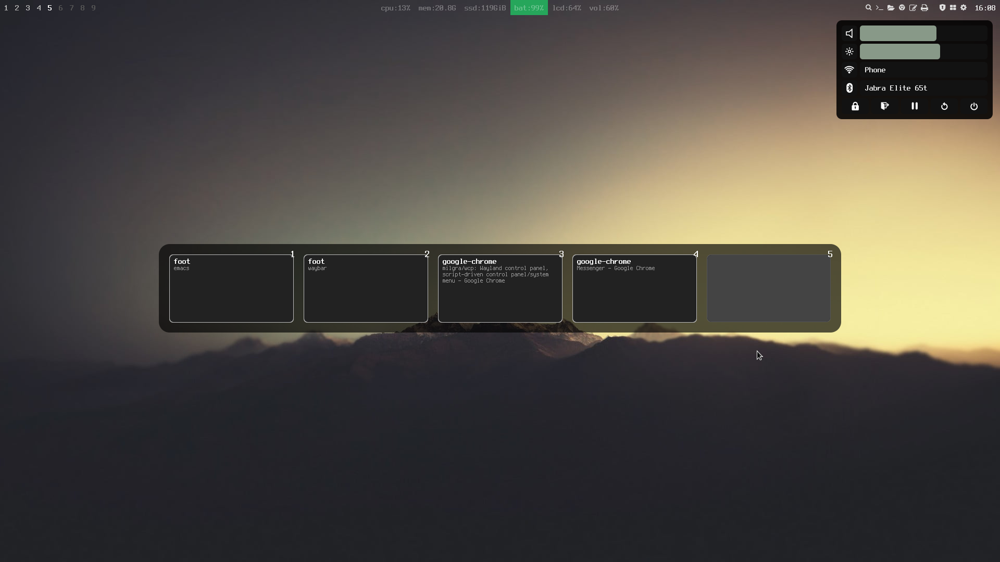

# wcp - Wayland Control Panel

Script-driven control panel/system menu for wayland based window managers.

Wayland Control Panel was made for SwayOS (https://swayos.github.io)

[](https://www.youtube.com/watch?v=36wwQSg9PSk)

Watch the introduction/user guide [video on youtube](https://www.youtube.com/watch?v=36wwQSg9PSk)

## Features ##

- content and style fully configurable via html and css
- functionality fully controllable via shell scripts
- super lightweight ( no gtk & qt )

## Description ##

Wayland control panel is an application for popup control menu, system menu or any kind of menu for UNIX-like operating systems.
You can trigger it's appereance with a shortcut or with a button in the status bar.
It can be structured via html, styled via css.
Button, label and slider values are coming from scripts and it can invoke scripts in case of interaction, it's totally configurable.
By default it looks for config files under ~/.config/wcp/ and falls back to /usr/local/share/wcp.

## Installation

### Compiling from source

Install dependencies:

- wayland
- freetype2 \*
- wayland-protocols \*
- meson \*
- png \*

\* _compile-time dependecy_

Run these commands:

```
git clone git@github.com:milgra/wcp.git
cd wcp
meson build --buildtype=release
ninja -C build
sudo ninja -C build install
```

### From packages

[](https://repology.org/project/wcp/versions)

## Usage

Launch wcp in a terminal, enter 0 to hide, 1 to show, 2 to toggle, 3 to quit wcp and press return.

```
wcp
```

### Usage with sway wm

Launch wcp in the config connected to a named pipe, but remove the named pipe first to avoid mkfifo errors.

```
exec rm -f /tmp/wcp && mkfifo /tmp/wcp && tail -f /tmp/wcp | wcp
```

Set up your sway config or menu bar config to toggle wcp

For example, to toggle with META+P
```
bindsym $mod+p exec "echo 2 > /tmp/wcp"
```

## Configuration

Copy the html, img and script folders from /usr/local/share/wcp under ~/.config/wcp/  
Edit ~/.config/wcp/html/main.html to add or remove new items from the control panel
Edit ~/.config/wcp/html/main.css to modify, add and remove styles.  
Add new images needed by new styles under ~/.config/wcp/img/  
Add new script under ~/.config/wcp/script  

### Creating new scripts

The idea is the following :  
if a script doesn't receive any arguments then it should return a string value ( integers between 0 and 100 in case of sliders, strings in case of labels ),  
if it receives an argument ( integer between 0 and 100 in case of sliders, 1 in case of button ) then the script should do something.

## Technical Info ##

WCP was written in Headerless C. It is about using the __INCLUDE_LEVEL__ preprocessor macro available in GCC/CLANG to guard the implementation part of a source file so you can place it together with the header definition in a single file and you include this file freely in other source files. Read more about this in (https://github.com/milgra/headerlessc);

WCP uses Kinetic UI as UI/Widget rendering engine. It is a modern, minimal ui renderer with html/css based stylimg written in headerless C. It offers MacOS like smooth kinetic animations and font-level animatioms, gpu or cpu based alpha blending, wayland connector with window and layer support and deterministic session record and replay for fully automated application testing.

WCP uses the mt_core library for retain counted memory management, retain counted and recursively observable vector and map containers and helper functions.

WCP uses meson and ninja for lightning fast compilation.

### Contribution/Development ##

Feel free to push fixes/improvements.

Please follow these guidelines :

- use clang format before commiting/after file save
- use zen_core functions and containers and memory handling
- make sure that the app is leak free. if you run the dev build it automagically checks for leaks on exit on two levels (zc_memory and clang address sanitizer ) and prints leaks

Creating a debug build :

```
CC=clang meson build --buildtype=debug -Db_sanitize=address -Db_lundef=false
ninja -C build
```

## Donate ##

paypal : [https://paypal.me/milgra](https://paypal.me/milgra)  
patreon : [https://www.patreon.com/milgra](https://www.patreon.com/milgra)  
bitcoin : 37cSZoyQckihNvy939AgwBNCiutUVN82du  

## License ##

GPLv3, see [LICENSE](/LICENSE).

## Roadmap ##

dirty rect errors fix
video on github page
clear makepkg errors
Keyboard control
Auto-tests with 2x scaling